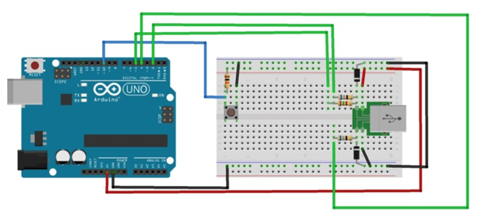

# HID - Visit Card/Business Card

Priectul a avut ca scop realizarea unui periferic de tip HID care va completa in mod automat datele de contact ale detinatorului. 
Astfel cand perifericul este conectat la un sistem prin apasarea butonului se va trimite pe USB textul ca si cum ar fi tastat.

## Piese necesare:
- Placuta de dezvoltare Arduino UNO
- Un buton si o rezistenta de 10 kΩ
- Pentru interfata electrica cu conexiunea USB
  - 2 diode Zener 3.6 V si 0.5 W (orice este mai mare de atat nu va functiona)
  - 2 rezistente de 68 Ω
  - o rezistenta de 2.2 kΩ

## Schema de conectare
In figura de mai jos este reprezentata schema de conectare a butonului si conexiunii USB:
- Butonul este conectat la pinul digital 10
- Conexiunea USB presupune: 
  - Linia D+ sa aiba o rezistenta de 68 kΩ in serie comandata de pinul digital 4, o rezistenta de 2.2 kΩ tot in serie comandata de pinul digital 5 si o dioda Zener la masa.
  - Linia D- sa aiba o rezistenta de 68 kΩ in serie comandata de pinul digital 2 si o dioda Zener la masa
  - In figura conexiunile rezistentelor de 68 kΩ sunt inversate dar in cazul meu nu a functionat si le-am interschimbat
  - Liniile de VCC si GND se conecteaza la 5V si GND pe placuta Arduino

Pentru a descarca biblioteca "UsbKeyboard.h" se acceseaza urmatorul link: https://code.google.com/archive/p/vusb-for-arduino/downloads